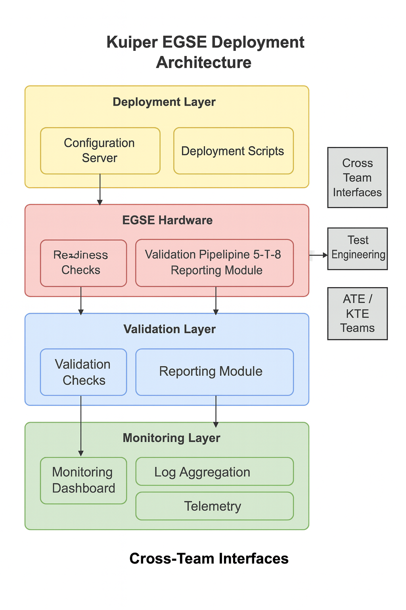

# 🛰️ Kuiper EGSE Deployment  
**Mission-Critical Satellite Test Infrastructure • EGSE / ATE / KTE • Secure Automation**

## 📌 Overview

This repository documents the engineering work behind deploying, maintaining, and supporting **Electrical Ground Support Equipment (EGSE)** systems used for satellite testing and validation.

The environment integrates **ATE**, **KTE**, **Linux/Windows hybrid systems**, and secure automation workflows to ensure reliable spacecraft testing operations.

This work reflects hands-on engineering in a **mission-critical aerospace environment**, where reliability, precision, and security are non-negotiable.

---

## 🧠 System Summary

The Kuiper EGSE deployment system integrates Linux and Windows servers with ATE/KTE test environments to support mission‑critical satellite validation. Configuration servers and automation scripts provision EGSE racks, while secure access controls and monitoring ensure reliability, compliance, and repeatability across eight deployment phases. This architecture enables cross‑functional engineering teams to execute spacecraft testing with precision and minimal downtime.

---

## 🚀 Why This Work Matters

EGSE systems are the backbone of spacecraft validation. Every satellite must pass through rigorous electrical, functional, and communication testing before it can be cleared for launch. Reliable EGSE deployments ensure that these tests run consistently across ATE/KTE environments, reducing mission risk and preventing costly delays. By standardizing deployments, securing access, and improving test reliability, this work directly contributes to spacecraft readiness and the overall success of mission-critical aerospace operations.

---

## 🧩 Engineering Challenges Solved

- Standardized EGSE deployments across mixed Linux/Windows environments  
- Reduced configuration drift through automated provisioning workflows  
- Improved test reliability across ATE/KTE systems used for spacecraft validation  
- Ensured secure access in a high-sensitivity aerospace environment (SSH, MFA, RBAC)  
- Enabled consistent multi-phase validation across repeated test cycles  
- Improved cross-team collaboration between software, hardware, and test engineering groups  
- Enhanced monitoring and logging to support rapid troubleshooting and uptime requirements  

---

## 🎯 Responsibilities & Scope

- Designed and deployed EGSE components across Linux and Windows systems  
- Supported ATE/KTE test environments for spacecraft validation  
- Automated deployment workflows to reduce manual configuration overhead  
- Ensured system reliability for continuous satellite testing operations  
- Collaborated with cross-functional aerospace engineering teams  
- Maintained secure access, logging, and compliance-aligned configurations  

---

## 🛠️ Technologies & Tools

### **Platform Stack**

| Category | Technologies | Purpose |
|---------|--------------|---------|
| **🖥️ Operating Systems** | Linux (Ubuntu, RHEL), Windows Server | Hybrid infrastructure supporting EGSE components |
| **⚙️ Automation** | Shell scripting, PowerShell, Python | Deployment automation and configuration management |
| **🌐 Networking** | TCP/IP, VLANs, Routing | Network infrastructure for test systems |
| **🔐 Security** | SSH, MFA, RBAC | Secure access controls and authentication |
| **📊 Monitoring** | Logging systems, Monitoring tools | System health and operational visibility |
| **🔌 Hardware** | EGSE interfaces, ATE systems, KTE systems | Spacecraft test equipment integration |

---

## 📈 Infrastructure Deployment Workflow

| Stage | Description |
|-------|-------------|
| 1. Environment Preparation | Validate cloud credentials, Terraform backend configuration, and workspace selection before deployment |
| 2. Module Initialization | Initialize Terraform modules, providers, and shared components used across environments |
| 3. Plan & Policy Validation | Run `terraform plan`, validate policies, and ensure Zero Trust and compliance rules are met |
| 4. Infrastructure Provisioning | Apply Terraform changes to deploy compute, networking, IAM, and supporting services |
| 5. Post‑Deployment Validation | Run automated validation scripts to confirm resource health, connectivity, and IAM correctness |
| 6. CI/CD Integration | Trigger pipelines for linting, formatting, security scanning, and automated promotion to higher environments |
| 7. Drift Detection | Compare deployed resources with Terraform state and reconcile differences across dev/stage/prod |
| 8. Documentation & Handoff | Update architecture docs, module references, and operational runbooks for ongoing maintenance |

---

## 🧩 Architecture Overview

Below is a simplified, sanitized architecture diagram representing the EGSE deployment workflow:
```
                +---------------------------+
                |       Spacecraft          |
                |     Test Interfaces       |
                +-------------+-------------+
                              |
                              v
                +---------------------------+
                |            EGSE           |
                |  (Electrical Ground       |
                |   Support Equipment)      |
                +-------------+-------------+
                              |
          +-------------------+-------------------+
          |                                       |
          v                                       v
+--------------------+                 +----------------------+
|   ATE Systems      |                 |   KTE Systems        |
| (Automated Test)   |                 | (Knowledge Test)     |
+---------+----------+                 +----------+-----------+
          |                                       |
          v                                       v
+--------------------+                 +----------------------+
| Linux Servers      |                 | Windows Servers      |
| Deployment Scripts |                 | PowerShell Modules   |
+---------+----------+                 +----------+-----------+
          |                                       |
          +-------------------+-------------------+
                              |
                              v
                +---------------------------+
                |  Logging & Monitoring     |
                |  Secure Access Controls   |
                +---------------------------+
```

---

### 📷 Visual Architecture Diagram (PNG)




---

## 🧩 Architecture Layers

| Layer | Components | Purpose |
|-------|------------|---------|
| **Deployment** | Configuration Server, Deployment Scripts | Automate provisioning and baseline setup |
| **EGSE Hardware** | EGSE Rack, Linux/Windows Test Nodes | Execute satellite test operations |
| **Validation** | Readiness Checks, Phase 1–8 Pipeline, Reporting | Certify system readiness and log results |
| **Monitoring** | Dashboard, Log Aggregation, Telemetry | Ensure system health and visibility |
| **Interfaces** | ATE/KTE Teams, Deployment Engineering | Enable cross‑team collaboration and feedback |

---

## 📊 Metrics Analyzed

| Metric Category | Purpose | Examples |
|-----------------|----------|----------|
| 🏗️ Infrastructure Health | Validate stability and performance of provisioned resources | CPU/Memory usage, disk IOPS, network throughput |
| 🔐 IAM & Access Metrics | Ensure least‑privilege and correct role assignments | Failed API calls, permission denials, role drift |
| 🌐 Network Performance | Confirm connectivity and routing correctness | Latency, packet loss, subnet reachability |
| 🔄 Pipeline Reliability | Measure CI/CD consistency and deployment success | Pipeline pass rate, linting errors, validation failures |
| 📦 Environment Drift | Detect configuration mismatches across environments | Drift reports, module version differences |
| ⚙️ Terraform Operations | Track IaC performance and correctness | Plan/apply duration, state lock frequency |

---

## 🔐 Authentication Workflow

| Step | Action | Purpose |
|------|--------|----------|
| 1 | Authenticate to cloud providers using service principals or federated identities | Ensures secure, auditable access to infrastructure APIs |
| 2 | Validate IAM roles and least‑privilege permissions before deployment | Prevents unauthorized Terraform operations |
| 3 | Initialize Terraform backend with authenticated state access | Protects state integrity and prevents drift |
| 4 | Run Terraform plan with authenticated provider sessions | Confirms resource changes against cloud APIs |
| 5 | Apply infrastructure changes using short‑lived credentials | Reduces long‑term credential exposure |
| 6 | Trigger CI/CD pipelines with scoped automation identities | Ensures pipelines operate under controlled permissions |
| 7 | Log all authentication events for audit and compliance | Provides traceability across environments |

---

## 🔧 Common Troubleshooting Scenarios

| Issue Type | Symptoms | Resolution |
|------------|----------|------------|
| 🗂️ Terraform State Issues | State lock errors, drift, failed plan/apply | Unlock or refresh state, validate backend, re‑run plan |
| 🔐 IAM Access Failures | Permission denied, missing roles, failed API calls | Verify IAM roles, confirm bindings, re‑run access bootstrap |
| 🌐 Network Connectivity Problems | Resources unreachable, routing failures, blocked traffic | Validate routing, security groups, firewall rules, re‑provision network modules |
| 🏗️ Module Dependency Conflicts | Graph errors, circular dependencies, module ordering issues | Break modules apart, add `depends_on`, rebuild module graph |
| 🔄 Pipeline & Automation Failures | CI/CD stops, linting errors, failed validation | Fix formatting, validate modules locally, re‑run pipeline |
| 📦 Environment Drift | Inconsistent outputs across dev/stage/prod | Pin module versions, use env‑specific variable files, run drift detection |
| 🔑 Secret Management Issues | Missing secrets, expired tokens, failed authentication | Rotate credentials, validate secret injection, re‑sync bootstrap |

---

## 🗂️ Repository Structure

A high-level map of the Kuiper EGSE Deployment repository:
```
Kuiper-EGSE-Deployment/
│
├── docs/
│   └── architecture_summary.md          # High-level architecture overview (sanitized)
│
├── procedures/
│   └── EGSE_Deployment_Summary.md       # Deployment process for 5 EGSE racks
│
├── scripts/
│   ├── onboarding_automation.ps1        # Engineer onboarding & access provisioning (sanitized)
│   ├── rack_initialization.py           # Rack diagnostics & readiness checks (sanitized)
│   └── Pipeline_Validation.py           # Multi-phase validation pipeline simulation
│
└── README.md                            # Main project documentation
```

### 📁 Directory Descriptions

| Directory | Purpose |
|-----------|---------|
| `docs/` | Architecture documentation and technical overviews |
| `procedures/` | Deployment runbooks and operational procedures |
| `scripts/` | Automation tools for deployment, validation, and provisioning |

### 📄 Key Files

- **[`architecture_summary.md`](https://github.com/Suren-Jewels/Kuiper-EGSE-Deployment/blob/main/docs/architecture_summary.md)** - System design and component relationships
- **[`EGSE_Deployment_Summary.md`](https://github.com/Suren-Jewels/Kuiper-EGSE-Deployment/blob/main/procedures/EGSE_Deployment_Summary.md)** - Step-by-step deployment procedures used across 8 phases
- **[`onboarding_automation.ps1`](https://github.com/Suren-Jewels/Kuiper-EGSE-Deployment/blob/main/scripts/onboarding_automation.ps1)** - PowerShell automation for engineer access provisioning
- **[`rack_initialization.py`](https://github.com/Suren-Jewels/Kuiper-EGSE-Deployment/blob/main/scripts/rack_initialization.py)** - Python diagnostics for EGSE rack readiness validation
- **[`Pipeline_Validation.py`](https://github.com/Suren-Jewels/Kuiper-EGSE-Deployment/blob/main/scripts/Pipeline_Validation.py)** - Multi-phase validation pipeline for deployment verification

---

## 🚀 Deployment Workflow

| Step | Action | Tools Used |
|------|--------|------------|
| **1** | Provision Linux and Windows hosts for EGSE components | Bash, PowerShell |
| **2** | Configure network interfaces, VLANs, and routing | Network tools |
| **3** | Deploy EGSE, ATE, and KTE modules | Python, Shell scripts |
| **4** | Apply secure access controls (SSH, MFA, RBAC) | Security frameworks |
| **5** | Validate hardware interfaces and test communication paths | EGSE tooling |
| **6** | Enable logging, monitoring, and automated health checks | Monitoring systems |
| **7** | Perform integration testing with spacecraft test systems | Test frameworks |

---

## ✅ Key Outcomes

| Area | Impact |
|------|--------|
| **⚡ Reliability** | Improved reliability of satellite test operations |
| **⏱️ Efficiency** | Reduced deployment time through automation |
| **🔒 Security** | Strengthened system security and access control |
| **🤝 Collaboration** | Enhanced collaboration between software, hardware, and test engineering teams |
| **🎯 Uptime** | Supported mission-critical testing cycles with minimal downtime |

---

## 🔒 Confidentiality Notice

All content is fully sanitized.  
No proprietary spacecraft data, internal documentation, or sensitive operational details are included.  
Only high-level engineering concepts and deployment patterns are described.

---

## 📫 Contact

**Suren Jewels**  
Senior Cloud Engineer • Infrastructure & Security Specialist  

*For inquiries about this project or collaboration opportunities, please reach out via LinkedIn.*

---

## 📄 License

This repository contains fully sanitized, non‑sensitive infrastructure patterns and deployment examples.  
All content is provided for educational and portfolio demonstration purposes only.

No proprietary configurations, internal cloud architectures, or confidential operational details are included.

You may reference or adapt the public patterns in this repository, but all real-world implementations must follow your organization’s security, compliance, and governance requirements.
